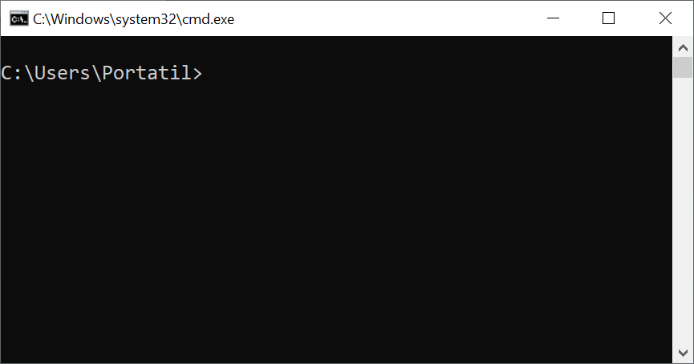
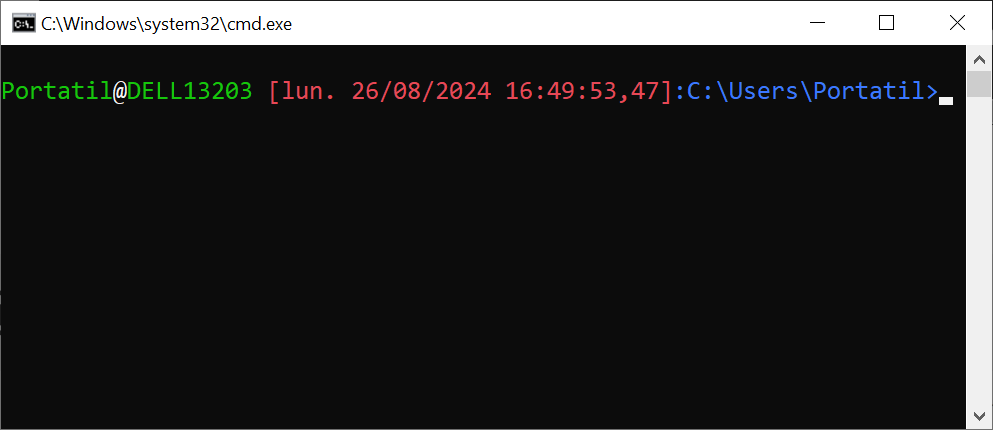
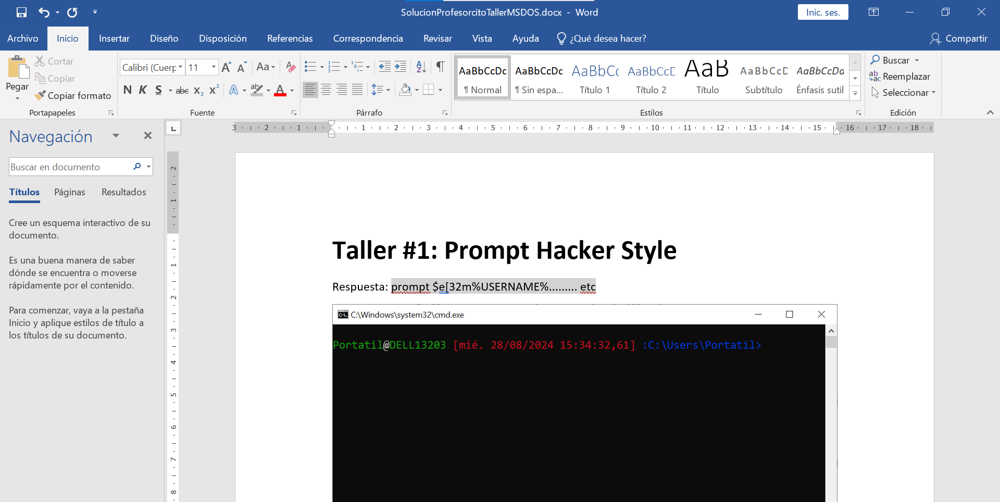
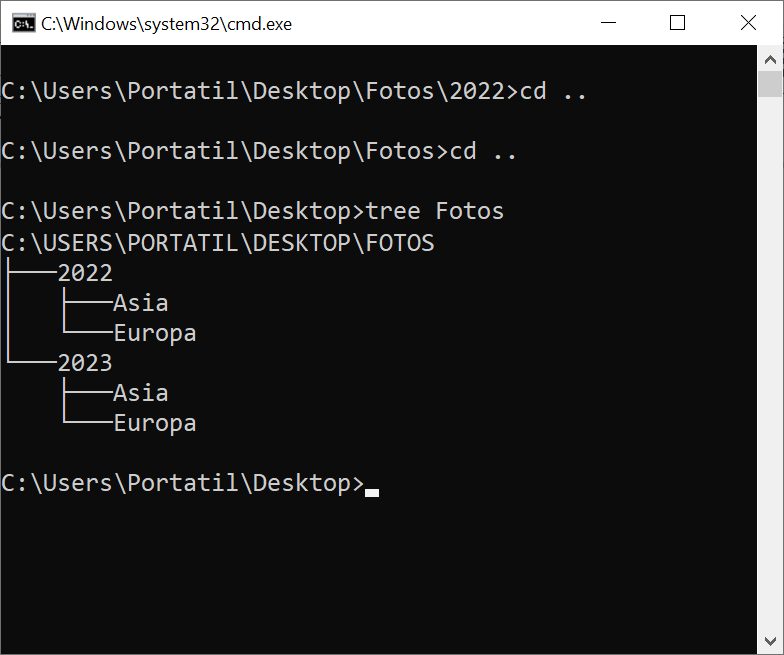
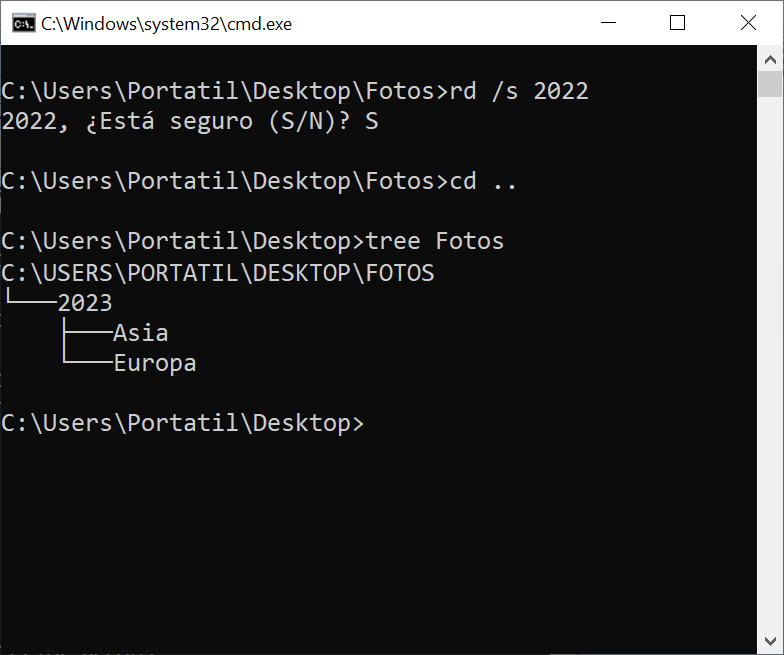
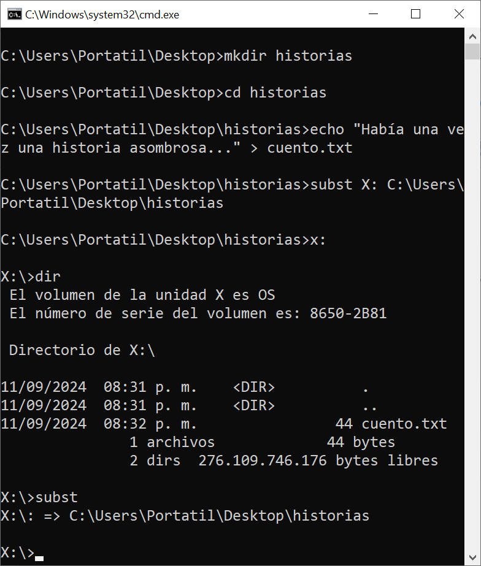

# 💻 ¡Adéntrate en el mundo de MS-DOS!

## Introducción

MS-DOS (Microsoft Disk Operating System) es la puerta de acceso al corazón de tu computadora. Un sistema operativo legendario que te otorga un poder sin igual. Más allá de las brillantes pantallas y los llamativos iconos, se esconde un mundo de comandos y posibilidades infinitas. Desvela los secretos de tu máquina y domina su funcionamiento con MS-DOS

### ¿Por qué se llama MS-DOS?

* **MS:** Estas siglas corresponden a "MicroSoft". Como su nombre indica, este sistema operativo fue desarrollado por la gigante del software Microsoft. 
* **DOS:** Significa "Disk Operating System" o en español "Sistema Operativo de Disco". Esto hace referencia a su función principal: gestionar el hardware de la computadora, especialmente los discos, y permitir la ejecución de programas. 

En resumen, **MS-DOS** significa "Sistema Operativo de Disco de Microsoft". Un nombre sencillo y directo que refleja su propósito y origen.

<details><summary>💡Hint: ¿Cuándo se creó MS-DOS?</summary>

MS-DOS nació a comienzos de la década de 1980.

</details>

## Cómo Abrir el Terminal (CMD)
Para empezar a usar MS-DOS en tu computadora con Windows, debes abrir el terminal. Sigue estos pasos:

1. **Presiona `Windows + R`** en tu teclado. Esto abrirá el cuadro de diálogo "Ejecutar".
2. En el cuadro de texto, escribe `cmd` y presiona `Enter`.
3. Se abrirá la ventana del terminal, donde podrás escribir y ejecutar comandos de MS-DOS.


<p align="center">
  
</p>

## Explorando el Símbolo del Sistema

El **prompt** es el símbolo que indica que el CMD está listo para recibir comandos. En este caso, el prompt podría ser `C:\Users\Portatil>`, indicando la ubicación actual en el sistema de archivos.

### **¿Se puede personalizar el prompt?**

**¡Sí, puedes personalizar tu prompt a tu gusto!** Aunque el CMD no es tan flexible como Bash en Linux, puedes cambiar el prompt utilizando el comando `prompt`. Este comando permite modificar el texto que se muestra antes de cada línea de comandos.

### **Ejemplos de Personalización del Prompt**

1. **Cambiar el prompt para que muestre el nombre de la carpeta actual:**

```cmd
prompt $p$g
```

- `$p` muestra la ruta actual.
- `$g` muestra el carácter `>`.

2. **Mostrar solo el texto "Hola Mundo":**

```cmd
prompt Hola Mundo
```

Esto cambia el prompt para que siempre muestre "Hola Mundo" en lugar de la ruta actual.

3. **Volver al prompt original (ruta y `>`):**

```cmd
prompt $p$g
```

4. **Mostrar la hora actual seguida de `>`:**

```cmd
prompt $t$g
```

- `$t` muestra la hora actual en formato de 24 horas.

## Tabla de Opciones del Prompt de MS-DOS

| Opción | Descripción | Ejemplo | Explicación |
|---|---|---|---|
| $A | & (Y comercial) | DIR $A | Lista los archivos con nombres que contienen el carácter "&" |
| $B | | (barra vertical) | DIR *.TXT$B*.DOC | Lista archivos con extensión .TXT o .DOC |
| $C | ( (paréntesis izquierdo) | ECHO ($CHola$F) | Imprime "Hola" entre paréntesis |
| $D | Fecha actual | ECHO La fecha de hoy es $D | Muestra la fecha del sistema |
| $E | Código de escape (código ASCII 27) | $E[2J | Limpia la pantalla (secuencia ANSI) |
| $F | ) (paréntesis derecho) | (Ver $C) |
| $G | > (signo mayor que) | DIR > lista.txt | Redirige la salida de DIR a un archivo |
| $H | Retroceso | ECHO Hola$Hmundo | Imprime "Holmundo" (el retroceso borra la "a") |
| $L | < (signo menor que) | SORT < lista.txt | Ordena el contenido de un archivo |
| $N | Unidad actual | ECHO La unidad actual es $N | Muestra la letra de la unidad actual |
| $P | Unidad y ruta de acceso actual | ECHO La ruta actual es $P | Muestra la ruta completa del directorio actual |
| $Q | = (signo igual) | IF EXIST archivo.txt ECHO El archivo existe | Compara cadenas |
| $S |   (espacio) | ECHO Esto$Stiene$Sespacios | Inserta espacios en blanco |
| $T | Hora actual | ECHO La hora actual es $T | Muestra la hora del sistema |
| $V | Número de versión de Windows | VER | Muestra la versión de Windows |
| $_ | Retorno de carro y alimentación de línea | ECHO Linea 1$_Linea 2 | Imprime dos líneas distintas |
| $$ | $ (signo del dólar) | ECHO El símbolo del dólar es $$ | Imprime el signo del dólar literal |

**Ejemplo**

Prueba utilizando estos prompts:

```
prompt Fecha:$D$_Hora:$T$_$P$G
```

```
prompt $E[1m$E[32mProfesorcito$E[0m - $E[34m$P$G$E[0m
```

<details><summary>🔎 Discovery: Colores secretos en tu terminal</summary>

## Tabla de Códigos de Escape ANSI para Colores

Los códigos ANSI son una estándar de la industria para controlar la apariencia del texto en terminales y emuladores de terminal. Aquí tienes una tabla simplificada de los códigos más comunes para establecer colores de fondo y texto:

| Código | Color de fondo | Código | Color de texto |
|---|---|---|---|
| 40 | Negro | 30 | Negro |
| 41 | Rojo | 31 | Rojo |
| 42 | Verde | 32 | Verde |
| 43 | Amarillo | 33 | Amarillo |
| 44 | Azul | 34 | Azul |
| 45 | Magenta | 35 | Magenta |
| 46 | Cian | 36 | Cian |
| 47 | Gris claro | 37 | Gris claro |

</details>

<details><summary>💡Hint: ¿Quieres un prompt personalizado para siempre?</summary>

## Como hacer permanentes los cambios en el prompt

Para establecer un prompt personalizado de forma permanente, abre una ventana de comandos y ejecuta el comando `setx PROMPT "$D$_$P$G"`. Este comando establecerá el prompt para mostrar la fecha, unidad y directorio actual.

</details>


<p align="center">
  
</p>

# Taller#1: Prompt Hacker Style 

**Objetivo:** Tu misión si desides aceptarla es que tu prompt sea como el que se indica en esta imagen:

<p align="center">
  
</p>

**La documentación es clave en cualquier proyecto. Para el Taller #1, te solicitamos:**

1. **Crea un nuevo documento de Word llamado `SoluciónTuNombreTallerMSDOS.**
2. **Incluye el siguiente título:** Taller #1: Prompt Hacker Style
3. **Copia y pega el prompt de tu respuesta:**
4. **Realiza una captura de pantalla** de cómo se ve este prompt en tu terminal o línea de comandos.

<details><summary>💡Hint: Captura tu pantalla como un pro</summary>

Para tomar ese pantallazo le puedes dar click a la ventana de `cmd` y presionas `Alt+Impr pant`

</details>

5. **Pega la captura de pantalla** en tu documento de Word.

**Ejemplo de cómo podría verse el documento de Word:**


<p align="center">
  
</p>

<input type="hidden" value="prompt $e[32m%USERNAME%$e[0m@$e[32m%USERDOMAIN%$e[0m $e[31m[$d $t]$e[0m $e[34m:$p$g$e[0m">


### 1. **DIR: Listar Archivos y Directorios**

El comando `DIR` se utiliza para listar los archivos y directorios en la ubicación actual.

**Ejemplo:**

* **Listar los archivos en la carpeta actual**

📂 **Estás aquí:** `C:\Users\Portatil`

⌨️ **Escribe esto:**

```cmd
dir
```

Este comando mostrará una lista de todos los archivos y carpetas en `C:\Users\Portatil`.

<details><summary>💡Hint: Descubre todo sobre DIR</summary>

**IMPORTANTE** Si quieres conocer todas las opciones que tienes para usar el comando DIR, simplemente escribe:

```
dir /?
```

Este pequeño truco funciona con casi todos los comandos de la línea de comandos. Al agregar "/?" al final de cualquier comando, estarás solicitando una ayuda detallada sobre cómo usarlo.

Explora otros comandos escribiendo `help` y luego agrega "/?" al final de cualquiera que te interese.

</details>

* **Listado recursivo del contenido de esta carpeta**

📂 **Estás aquí:** `C:\Users\Portatil`

⌨️ **Escribe esto:**

```cmd
dir /s
```

Este comando hará un listado recursivo de todos los archivos y subcarpetas empezando desde el directorio actual (`C:\Users\Portatil`) y descendiendo por toda la estructura de carpetas de tu disco. Es decir, te mostrará un listado completo de todo lo que hay almacenado en esa *rama* de tu sistema de archivos.

<details><summary>💡 Hint: ¿Cómo detener un listado extenso?</summary>

Si estás ejecutando un comando como `dir /s` y la lista de archivos y carpetas tarda demasiado, puedes interrumpir el proceso en cualquier momento presionando `Ctrl+C`. Esta combinación de teclas enviará una señal al sistema para detener la ejecución del comando.

</details>

* **Listar y guardar archivos .jpg**

Para listar todos los archivos `.jpg` y guardar los resultados en un archivo de texto llamado `imagenes.txt`, utiliza una combinación de comandos. Primero, el comando `dir` con opciones específicas para buscar archivos `.jpg`, luego redirige la salida a un archivo de texto:

📂 **Estás aquí:** `C:\Users\Portatil`

⌨️ **Escribe esto:**

```cmd
dir /s /b *.jpg > imagenes.txt
```

Este comando buscará recursivamente todos los archivos `.jpg` desde la ubicación actual y guardará la lista en `imagenes.txt`.

**Explicación**

Imaginemos que tu computadora es un gran árbol. Cada carpeta es una rama y cada archivo es una hoja. El comando que estás viendo es como un explorador que se adentra en este árbol para buscar hojas de un tipo específico (en este caso, imágenes .jpg).

* **`dir`:** Esta es la palabra clave que le dice a tu computadora: "Quiero ver el contenido de una carpeta".
* **`/s`:**  Esta opción es como decirle al explorador: "No te detengas en la primera rama. Sigue explorando todas las ramas y subramas hasta el final del árbol."
* **`/b`:** Esta opción le indica al explorador: "Solo muéstrame el nombre de cada hoja, no me interesa otra información como el tamaño o la fecha".
* **`*.jpg`:**  Aquí le decimos al explorador: "Estoy buscando hojas que tengan la etiqueta '.jpg'.".
* **`> imagenes.txt`:**  Finalmente, le decimos: "Cuando hayas encontrado todas las hojas que buscas, escribe sus nombres en un papel llamado 'imagenes.txt'. Este papel lo guardaré en el lugar donde estoy parado ahora".

**Ejemplo completo desde la raíz**

Si deseas iniciar la búsqueda desde la raíz de tu sistema (generalmente `C:\`), sigue estos pasos:

📂 **Estás aquí antes de empezar:** `C:\Users\Portatil`

⌨️ **Escribe esto:**

1. Cambia al directorio raíz con:

   ```cmd
   cd \
   ```

   📂 **Ahora estás aquí:** `C:\`

2. Luego, lista todos los archivos `.jpg` desde la raíz:

   ```cmd
   dir /s /b *.jpg
   ```

Después de ejecutar `cd \`, la ubicación cambia a `C:\`, permitiéndote buscar todos los archivos `.jpg` desde la raíz, explorando todas las carpetas y subcarpetas de tu disco.

&nbsp;

<p align="center">
  
</p>

# Taller #2:  Exploradores de Archivos &mdash; Dominando el Comando dir

**Objetivo:** Desbloquear el verdadero potencial de la línea de comandos en MSDOS. ¿Tienes lo necesario para convertirte en un maestro de la línea de comandos?

**Documentación:** Al final de tu documento 'SoluciónTuNombreTallerMSDOS.docx', inserta un salto de página y comienza una nueva sección con el título: **Taller #2: Exploradores de Archivos &mdash; Dominando el comando dir**. En esta sección, documenta tu experiencia y tus hallazgos en cada uno de las siguientes operaciones y pasos: 

### **Operación 1: Explorador de lo Desconocido**

**Paso 1:** El primer paso hacia el dominio de la línea de comandos es explorar tu territorio. Inicia una misión de reconocimiento listando todos los archivos y carpetas en tu directorio principal.

📂 **Estás aquí:** `C:\Users\Portatil`

⌨️ **Escribe esto:**

```cmd
dir
```

Este comando lista todos los archivos y carpetas en la ubicación actual.

**Paso 2:** ¡Hora de profundizar! Realiza un escaneo recursivo de todos los archivos y carpetas, revelando todo lo que se esconde en las profundidades de tu sistema.

📂 **Estás aquí:** `C:\Users\Portatil`

⌨️ **Escribe esto:**

```cmd
dir /s
```

Esto escanea y lista todos los archivos y subcarpetas desde el directorio actual hacia abajo.

<details><summary>💪 Challenge: Explora lo invisible en tu sistema</summary>

**¿Puedes encontrar un archivo oculto o alguna carpeta que no esperabas?**

Para revelar archivos ocultos en tu sistema, usa este comando:

```cmd
dir /s /ah /b
```

Esto mostrará todos los archivos y carpetas ocultos desde tu ubicación actual.
</details>

---

### **Operación 2: Búsqueda y Rescate de Archivos Perdidos**

**Paso 3:** Tu misión es localizar todos los archivos `.txt` en tu sistema, sin importar dónde se encuentren, y recopilarlos en un archivo de texto llamado `archivos_rescatados.txt`.

📂 **Estás aquí:** `C:\Users\Portatil`

⌨️ **Escribe esto:**

```cmd
dir /s /b *.txt > archivos_rescatados.txt
```

Este comando busca todos los archivos `.txt` y guarda la lista en `archivos_rescatados.txt`.

**Desafío Extra:** ¿Puedes filtrar los archivos por fecha o tamaño? Intenta encontrar los archivos `.txt` más recientes o más antiguos.

⌨️ **Escribe esto:**

```cmd
dir /s /b *.txt /o:-d > archivos_rescatados.txt
```

Este comando lista los archivos `.txt` ordenados por fecha, del más reciente al más antiguo.

**Paso 4:** Abre el archivo `archivos_rescatados.txt` para inspeccionar tu trabajo.

⌨️ **Escribe esto:**

```cmd
notepad archivos_rescatados.txt
```

Revisa cuántos archivos has rescatado y planifica tu próximo movimiento.

---

### **Operación 3: Creación de un Señuelo y Confusión del Enemigo**

**Paso 5:** Copia el archivo `archivos_rescatados.txt` y crea un señuelo llamado `trampa.txt`.

📂 **Estás aquí:** `C:\Users\Portatil`

⌨️ **Escribe esto:**

```cmd
copy archivos_rescatados.txt trampa.txt
```

---

### **Operación 4: Maestro del Camuflaje**

**Paso 6:** Oculta el archivo `trampa.txt` en una carpeta secreta y haz que sea invisible.

📂 **Estás aquí:** `C:\Users\Portatil`

⌨️ **Escribe esto:**

```cmd
mkdir Oculto
move trampa.txt Oculto
attrib +h +s Oculto
```

Esto crea la carpeta `Oculto`, mueve el archivo `trampa.txt` a ella y la convierte en una carpeta oculta.

<details><summary>🎩 Tricks: Conviértete en un mago de la terminal</summary>

¿Quieres abrir tu explorador de archivos como un mago? Usa este comando:

```cmd
start .
```

Este "hechizo" abrirá el explorador de archivos justo donde te encuentras.

Otros "hechizos":

- **Abre la calculadora:** `start calc`
- **Abre una página web:** `start www.javerianacali.edu.co`
- **Diviértete con un loro virtual:** `curl parrot.live`

</details>

---

**Desafío Final:** Encuentra de nuevo la carpeta oculta y accede al archivo.

📂 **Estás aquí:** `C:\Users\Portatil`

⌨️ **Escribe esto:**

```cmd
attrib -h -s Oculto
cd Oculto
```

📂 **Ahora estás aquí:** `C:\Users\Portatil\Oculto`

⌨️ **Escribe esto para ver el contenido:**

```cmd
dir
```

Este comando desoculta la carpeta `Oculto`, cambia a esa ubicación (`C:\Users\Portatil\Oculto`) y muestra su contenido, permitiéndote ver los archivos escondidos.

### 2. **CHDIR (o CD): Cambiar de Directorio**

Los comandos `CHDIR` y `CD` te permiten navegar entre carpetas en tu sistema de archivos, moviéndote de un directorio a otro.

**Ejemplos:**

* **Cambiar a un directorio específico**

📂 **Estás aquí:** `C:\Users\Portatil`

⌨️ **Escribe esto:**

```cmd
cd Desktop
```

📂 **Ahora estás aquí:** `C:\Users\Portatil\Desktop`

Este comando cambia el directorio actual a `C:\Users\Portatil\Desktop`.

---

* **Subir un nivel en la jerarquía de directorios**

📂 **Estás aquí:** `C:\Users\Portatil\Desktop`

⌨️ **Escribe esto:**

```cmd
cd ..
```

📂 **Ahora estás aquí:** `C:\Users\Portatil`

El comando `cd ..` te lleva al directorio padre.

---

* **Cambiar a la raíz del disco**

📂 **Estás aquí:** `C:\Users\Portatil`

⌨️ **Escribe esto:**

```cmd
cd \
```

📂 **Ahora estás aquí:** `C:\`

Este comando te lleva al directorio raíz del disco.

---

* **Regresar al directorio HOME**

📂 **Estás aquí:** `C:\`

⌨️ **Escribe esto:**

```cmd
cd %HOMEPATH%
```

📂 **Ahora estás aquí:** `C:\Users\Portatil`

El comando `%HOMEPATH%` es una variable del sistema que te lleva a tu carpeta de usuario. Si deseas explorar todas las variables del sistema, escribe `SET` y presiona Enter para ver una lista completa.

---

### 3. **MKDIR (o MD): Tu Constructor de Carpetas Personal**

Imagina que tu computadora es una gran casa y que las carpetas son las habitaciones. Con el comando `mkdir` (que significa "make directory" o crear directorio), puedes construir nuevas "habitaciones" para organizar tus archivos.

**¿Cómo se usa?**

La sintaxis básica es muy sencilla:

```bash
mkdir nombre_de_la_carpeta
```

Por ejemplo, para crear una carpeta llamada "Mis Documentos" en tu escritorio:

📂 **Estás aquí:** `C:\Users\Portatil\Desktop`

⌨️ **Escribe esto:**

```bash
mkdir "Mis Documentos"
```

<details><summary>💡 Hint: Ahorra tiempo con este comando corto</summary>

En realidad, puedes usar tanto `mkdir` como `md` para el mismo propósito. Son dos formas diferentes de decir lo mismo. Así que si prefieres escribir menos, puedes usar simplemente:

📂 **Estás aquí:** `C:\Users\Portatil\Desktop`

⌨️ **Escribe esto:**

```bash
md "Mis Documentos"
```

Ambos comandos lograrán el mismo resultado, pero `md` es más corto y rápido de escribir.
</details>

---

**Creando estructuras de carpetas más complejas**

¿Quieres crear varias carpetas a la vez o dentro de otras? ¡También puedes hacer eso!

* **Crear varias carpetas a la vez:**

📂 **Estás aquí:** `C:\Users\Portatil\Desktop`

⌨️ **Escribe esto:**

```bash
mkdir Carpeta1 Carpeta2 Carpeta3
```

Esto creará las carpetas "Carpeta1", "Carpeta2" y "Carpeta3" en tu escritorio.

---

* **Crear una carpeta dentro de otra:**

📂 **Estás aquí:** `C:\Users\Portatil\Desktop`

⌨️ **Escribe esto:**

```bash
mkdir Documentos\Trabajo\Proyectos
```

Este comando creará una carpeta llamada "Documentos" en el escritorio (C:\Users\Portatil\Desktop), dentro de la cual se creará la carpeta "Trabajo", y dentro de "Trabajo" se creará la carpeta "Proyectos".

---

Gracias por señalarlo. Aquí está la corrección incluyendo la creación de las carpetas "Europa" y "Asia" dentro de la carpeta "2022":

---

**Ejemplo práctico para tu escritorio**

Imagina que quieres organizar tus fotos de vacaciones. Puedes crear una estructura de carpetas así:

📂 **Estás aquí:** `C:\Users\Portatil\Desktop`

⌨️ **Escribe esto:**

```bash
mkdir Fotos
cd Fotos
```

📂 **Ahora estás aquí:** `C:\Users\Portatil\Desktop\Fotos`

⌨️ **Escribe esto:**

```bash
mkdir 2023 2022
cd 2023
```

📂 **Ahora estás aquí:** `C:\Users\Portatil\Desktop\Fotos\2023`

⌨️ **Escribe esto:**

```bash
mkdir Europa Asia
```

📂 **Ahora vuelve a la carpeta "Fotos":**

```bash
cd ..\2022
```

📂 **Ahora estás aquí:** `C:\Users\Portatil\Desktop\Fotos\2022`

⌨️ **Escribe esto:**

```bash
mkdir Europa Asia
```

Con estos comandos, habrás creado una carpeta principal llamada "Fotos" en tu escritorio y, dentro de ella, carpetas para los años 2023 y 2022, con subcarpetas para "Europa" y "Asia" en cada año, organizando tus fotos por año y continente.

---

**Visualiza la estructura que has creado**

Para ver cómo quedó toda la estructura de la carpeta "Fotos", vuelve a la carpeta "Fotos" y usa el comando `tree`:

📂 **Estás aquí:** `C:\Users\Portatil\Desktop\Fotos\2022`

⌨️ **Escribe esto para regresar a "Fotos":**

```bash
cd ..
```

📂 **Estás aquí:** `C:\Users\Portatil\Desktop\Fotos`

⌨️ **Escribe esto para regresar a "Fotos":**

```bash
cd ..
```

📂 **Ahora estás aquí:** `C:\Users\Portatil\Desktop`

⌨️ **Escribe esto:**

```bash
tree Fotos
```

Este comando mostrará una vista en árbol de toda la estructura de la carpeta "Fotos", incluyendo todas las subcarpetas y archivos, permitiéndote ver visualmente todo lo que has construido.


<p align="center">
  
</p>

<details><summary>💪 Challenge: Crear 10 carpetas con un comando</summary>

### Desafío: Crear diez carpetas en un solo comando

**Enunciado:** 
Crea 10 carpetas consecutivas, desde "carpeta1" hasta "carpeta10", utilizando un solo comando en la línea de comandos.

**Solución:**

```bash
for /l %i in (1,1,10) do md carpeta%i
```

**Explicación Detallada:**

**1. `for /l`:**

* Este es el inicio de un bucle `for` de tipo "incremental". Se utiliza para repetir una acción un número determinado de veces.

**2. `%i`:**

* Esta es una variable que se utilizará para almacenar el valor actual en cada iteración del bucle.

**3. `(1,1,10)`:**

* Estos tres números dentro de los paréntesis especifican los parámetros del bucle:
    * **1:** Valor inicial de la variable `%i`.
    * **1:** Incremento de la variable `%i` en cada iteración.
    * **10:** Valor final de la variable `%i`.

**4. `do`:**

* Indica el inicio del bloque de código que se ejecutará en cada iteración del bucle.

**5. `md carpeta%i`:**

* Este es el comando que se ejecutará dentro del bucle.
    * `md`: Es el comando para crear un directorio (carpeta).
    * `carpeta%i`: Es el nombre de la carpeta que se creará. El `%i` se reemplazará por el valor actual de la variable `%i` en cada iteración.

</details>

---

### 4. **RMDIR (o RD): Elimina Carpetas**

Así como `mkdir` te permite construir nuevas carpetas ("habitaciones") en tu computadora, `rmdir` es tu herramienta para eliminarlas cuando ya no las necesitas. Este comando elimina directorios (carpetas) que estén vacíos y ya no sean útiles para ti.

**¿Cómo se usa?**

La sintaxis básica es muy sencilla:

```bash
rmdir nombre_de_la_carpeta
```

Por ejemplo, si tienes una carpeta vacía llamada "Proyectos Viejos" que ya no necesitas, puedes eliminarla con:

📂 **Estás aquí:** `C:\Users\Portatil\Desktop`

⌨️ **Escribe esto:**

```bash
mkdir "Proyectos Viejos"
rmdir "Proyectos Viejos"
```

<details><summary>💡 Hint: La versión corta de rmdir que necesitas conocer</summary>

Al igual que con `mkdir`, puedes usar tanto `rmdir` como `rd` para el mismo propósito. Son dos formas diferentes de decir lo mismo. Así que si prefieres escribir menos, puedes usar simplemente:

Ambos comandos hacen exactamente lo mismo, pero `rd` es una forma más rápida de escribir.
</details>

---

**Eliminando carpetas que contienen otras carpetas**

Si tienes una carpeta que contiene otras subcarpetas o archivos y deseas eliminarla por completo, debes usar el parámetro `/s`. Esto le indicará a `rmdir` que elimine la carpeta y todo su contenido, incluidos los archivos y subcarpetas.

El comando te pedirá confirmación antes de proceder. Si estás seguro, puedes responder "S" (o "Y" si tu sistema está en inglés) para confirmar la eliminación.

**Ejemplo práctico para tu escritorio**

Imagina que organizaste tus fotos en varias carpetas, pero ahora ya no necesitas las carpetas de un año en particular:

📂 **Estás aquí:** `C:\Users\Portatil\Desktop\Fotos`

⌨️ **Escribe esto:**

```bash
rd /s 2022
```

Con esto, eliminarás la carpeta "2022" y todo su contenido, liberando espacio en tu computadora y manteniendo tus archivos organizados.

**Visualiza la estructura modificada**

Para ver cómo quedó toda la estructura de la carpeta "Fotos" después de las modificaciones, sigue estos pasos:

📂 **Estás aquí:** `C:\Users\Portatil\Desktop\Fotos`

⌨️ **Escribe esto para regresar al escritorio:**

```bash
cd ..
```

📂 **Ahora estás aquí:** `C:\Users\Portatil\Desktop`

⌨️ **Escribe esto para visualizar la estructura completa de la carpeta "Fotos":**

```bash
tree Fotos
```

Este comando mostrará una vista en árbol de todas las carpetas y subcarpetas dentro de "Fotos". Como puedes ver en la imagen, la estructura muestra las carpetas "Europa" y "Asia" dentro del año "2023", pero la carpeta "2022" ya no aparece, confirmando que fue eliminada correctamente.

<p align="center">
  
</p>

---

### 5. **COPY: Copiar Archivos**

El comando `COPY` se utiliza para duplicar archivos de una ubicación a otra, permitiéndote crear copias de seguridad o mover información de un lugar a otro sin alterar el archivo original.

**¿Cómo se usa?**

La sintaxis básica es:

```bash
copy archivo_origen ruta_destino
```

**Ejemplo práctico:**

Primero, vamos a crear un archivo `ejemplo.txt` y una carpeta de respaldo `Backup` en el escritorio, y luego copiaremos el archivo a la carpeta.

📂 **Estás aquí:** `C:\Users\Portatil\Desktop`

⌨️ **Escribe esto para crear un archivo de texto:**

```cmd
echo "Este es un archivo de ejemplo" > ejemplo.txt
```

Luego, crea la carpeta `Backup` en el escritorio.

```cmd
mkdir Backup
```

Ahora, copiaremos el archivo `ejemplo.txt` a la carpeta `Backup`.

📂 **Estás aquí:** `C:\Users\Portatil\Desktop`

⌨️ **Escribe esto para copiar el archivo:**

```cmd
copy ejemplo.txt Backup
```

Para confirmar que el archivo se copió correctamente, lista el contenido de la carpeta `Backup`.

📂 **Estás aquí:** `C:\Users\Portatil\Desktop`

⌨️ **Escribe esto para verificar:**

```cmd
dir Backup
```

Deberías ver `ejemplo.txt` listado entre los archivos de la carpeta `Backup`, lo que confirma que la copia se realizó con éxito.

&nbsp;

<p align="center">
  
</p>

# Taller #3: Rescatar los Archivos

**Objetivo:** Utilizar el comando `COPY`, `MKDIR` y `DIR` para salvar los archivos cruciales de tu proyecto antes de que sean "capturados". ¡Completa las misiones y mantén tus datos a salvo!

**Documentación:** Al final de tu documento 'SoluciónTuNombreTallerMSDOS.docx', inserta un salto de página y comienza una nueva sección con el título: **Taller #3: Rescatar los Archivos**. En esta sección, documenta tu experiencia y tus hallazgos en cada uno de las siguientes operaciones y pasos: 

### **Operación 1: Preparativos**

**Paso 1:** Primero, necesitamos crear un "cuartel general" para nuestros archivos. Vamos a crear una carpeta llamada `MisiónSecreta` en tu escritorio.

📂 **Estás aquí:** `C:\Users\Portatil`

⌨️ **Escribe esto para crear la carpeta:**

```cmd
mkdir Desktop\MisiónSecreta
```

**Paso 2:** Navega a la carpeta `MisiónSecreta`.

📂 **Estás aquí:** `C:\Users\Portatil`

⌨️ **Escribe esto para entrar a la carpeta:**

```cmd
cd Desktop\MisiónSecreta
```

**Paso 3:** Crea tres "documentos secretos" en tu cuartel general.

📂 **Estás aquí:** `C:\Users\Portatil\Desktop\MisiónSecreta`

⌨️ **Escribe esto para crear los documentos:**

```cmd
echo Información clasificada > doc1.txt
echo Proyecto Ultrasecreto > doc2.txt
echo Archivo Confidencial > doc3.txt
```

---

### **Operación 2: Creando un Refugio Seguro**

**Paso 4:** Ahora, necesitamos un refugio seguro para estos archivos en caso de emergencia. Crea una carpeta llamada `Refugio` dentro de `MisiónSecreta`.

📂 **Estás aquí:** `C:\Users\Portatil\Desktop\MisiónSecreta`

⌨️ **Escribe esto para crear la carpeta Refugio:**

```cmd
mkdir Refugio
```

**Paso 5:** ¡Atención! Los archivos corren peligro. Copia todos los archivos `.txt` al refugio antes de que sea demasiado tarde.

📂 **Estás aquí:** `C:\Users\Portatil\Desktop\MisiónSecreta`

⌨️ **Escribe esto para copiar los archivos al refugio:**

```cmd
copy *.txt Refugio
```

**Paso 6:** Verifica que todos los documentos secretos hayan llegado al refugio.

📂 **Estás aquí:** `C:\Users\Portatil\Desktop\MisiónSecreta`

⌨️ **Escribe esto para ver el contenido del refugio:**

```cmd
dir Refugio
```

---

### **Operación 3: Diversión en la Confusión**

**Paso 7:** Para despistar a los "enemigos", copia el archivo `doc1.txt` y renómbralo como `documento_falso.txt`. Este archivo será el señuelo.

📂 **Estás aquí:** `C:\Users\Portatil\Desktop\MisiónSecreta`

⌨️ **Escribe esto para crear el señuelo:**

```cmd
copy doc1.txt Refugio\documento_falso.txt
```

**Paso 8:** Revisa el refugio y asegúrate de que el señuelo esté en su lugar.

📂 **Estás aquí:** `C:\Users\Portatil\Desktop\MisiónSecreta`

⌨️ **Escribe esto para verificar el contenido del refugio:**

```cmd
dir Refugio
```

---

### **Operación 4: Misión Especial**

**Paso 9:** Los "enemigos" han encontrado tu cuartel general, ¡es hora de evacuar un archivo al exterior! Copia `doc2.txt` a una ubicación fuera del cuartel, específicamente al escritorio.

📂 **Estás aquí:** `C:\Users\Portatil\Desktop\MisiónSecreta`

⌨️ **Escribe esto para evacuar el archivo al escritorio:**

```cmd
copy doc2.txt ..\
```

Este comando copia `doc2.txt` directamente a la carpeta `Desktop`, que es el escritorio.

**Paso 10:** Comprueba que el archivo ha sido exitosamente evacuado al escritorio.

📂 **Estás aquí:** `C:\Users\Portatil\Desktop\MisiónSecreta`

⌨️ **Escribe esto para regresar al escritorio y verificar el archivo:**

```cmd
cd ..
```

📂 **Ahora estás aquí:** `C:\Users\Portatil\Desktop`

⌨️ **Escribe esto para ver los archivos en el escritorio:**

```cmd
dir
```

Esto te permitirá ver una lista de los archivos y carpetas en el escritorio, confirmando que `doc2.txt` ha sido copiado correctamente.

---

### 6. **MOVE: Mover Archivos**

El comando `MOVE` se utiliza para trasladar archivos de una ubicación a otra, moviéndolos físicamente sin dejar una copia en la ubicación original.

**¿Cómo se usa?**

La sintaxis básica es:

```bash
move archivo_origen ruta_destino
```

**Ejemplo práctico:**

Imaginemos que estás trabajando con archivos relacionados con un proyecto de "Informe de Ventas" y quieres organizar tu escritorio moviendo esos archivos a una nueva carpeta de manera ordenada.

📂 **Estás aquí:** `C:\Users\Portatil\Desktop`

**Paso 1:** Crea un archivo de texto llamado `ventas_2023.txt` que contenga un resumen detallado de ventas.

⌨️ **Escribe esto para crear el archivo con información relevante:**

```cmd
echo Informe de Ventas 2023 > ventas_2023.txt
echo ---------------------- >> ventas_2023.txt
echo Total Ventas: $120,000 >> ventas_2023.txt
echo Productos Más Vendidos: >> ventas_2023.txt
echo - Teléfonos: $45,000 >> ventas_2023.txt
echo - Laptops: $30,000 >> ventas_2023.txt
echo - Tablets: $20,000 >> ventas_2023.txt
echo - Accesorios: $25,000 >> ventas_2023.txt
echo Comentarios: Las ventas aumentaron un 15% respecto al año anterior. >> ventas_2023.txt
```

<details><summary>💡 Hint: ¿Cuál es la diferencia entre > y >>?</summary>

### Diferencia entre `>` y `>>` en la Terminal

- **`>` (Redirección de Salida):** Este operador se utiliza para crear un nuevo archivo o sobrescribir un archivo existente con el contenido especificado. Cada vez que usas `>`, cualquier contenido previo del archivo se borra y se reemplaza con el nuevo texto.

  **Ejemplo:**
  ```bash
  echo "Este es un nuevo archivo" > ejemplo.txt
  ```
  Esto creará `ejemplo.txt` con el texto "Este es un nuevo archivo". Si `ejemplo.txt` ya existía, su contenido anterior será eliminado.

- **`>>` (Redirección de Salida con Anexado):** Este operador agrega nuevo contenido al final de un archivo existente sin borrar lo que ya estaba. Es ideal para seguir añadiendo información a un archivo sin perder los datos previos.

  **Ejemplo:**
  ```bash
  echo "Añadiendo más información" >> ejemplo.txt
  ```
  Esto agregará "Añadiendo más información" al final de `ejemplo.txt`, conservando el contenido que ya tenía.

Usa `>` cuando necesites empezar de nuevo o crear un archivo desde cero, y `>>` cuando quieras agregar información sin borrar lo anterior. ¡Así puedes manejar tus archivos con total precisión!

</details>


**Paso 2:** Crea una nueva carpeta llamada `Informes` en el escritorio para organizar estos archivos.

⌨️ **Escribe esto para crear la carpeta:**

```cmd
mkdir Informes
```

**Paso 3:** Mueve el archivo `ventas_2023.txt` desde el escritorio a la carpeta `Informes`.

📂 **Estás aquí:** `C:\Users\Portatil\Desktop`

⌨️ **Escribe esto para mover el archivo:**

```cmd
move ventas_2023.txt Informes
```

Este comando trasladará `ventas_2023.txt` desde el escritorio a la carpeta `Informes`.

**Paso 4:** Verifica que el archivo fue movido correctamente a la carpeta `Informes`.

📂 **Estás aquí:** `C:\Users\Portatil\Desktop`

⌨️ **Escribe esto para ver los archivos dentro de la carpeta `Informes`:**

```cmd
dir Informes
```

Verás que `ventas_2023.txt` ahora está dentro de la carpeta `Informes`, confirmando que el movimiento se realizó con éxito.

---

### 7. **DEL: Eliminar Archivos**

El comando `DEL` se utiliza para eliminar archivos de manera permanente del directorio actual. Utilízalo con precaución, ya que los archivos eliminados no se envían a la papelera de reciclaje y no se pueden recuperar fácilmente.

**¿Cómo se usa?**

La sintaxis básica es:

```bash
del nombre_del_archivo
```

**Ejemplo práctico:**

Imaginemos que después de revisar tu informe de ventas, te das cuenta de que `ventas_2023.txt` ya no es necesario y quieres eliminarlo para mantener tu carpeta limpia.

📂 **Estás aquí:** `C:\Users\Portatil\Desktop\Informes`

**Paso 1:** Verifica el contenido de la carpeta para asegurarte de que `ventas_2023.txt` está presente.

⌨️ **Escribe esto para listar los archivos:**

```cmd
dir
```

**Paso 2:** Elimina el archivo `ventas_2023.txt`.

⌨️ **Escribe esto para eliminar el archivo:**

```cmd
del ventas_2023.txt
```

Esto eliminará el archivo `ventas_2023.txt` del directorio actual (`C:\Users\Portatil\Desktop\Informes`).

**Paso 3:** Verifica que el archivo ha sido eliminado.

⌨️ **Escribe esto para confirmar que el archivo ya no está:**

```cmd
dir
```

Verás que `ventas_2023.txt` ya no aparece en la lista, confirmando que fue eliminado correctamente.

---

### 8. **REN: Renombrar Archivos**

El comando `REN` se utiliza para cambiar el nombre de uno o más archivos, lo cual es útil para mantener tus archivos organizados y con nombres más descriptivos.

**¿Cómo se usa?**

La sintaxis básica es:

```bash
ren nombre_actual nuevo_nombre
```

**Ejemplo práctico:**

Imaginemos que estás trabajando con un archivo de notas del curso "Aspectos Básicos de la Computación" y quieres renombrarlo para que sea más específico.

📂 **Estás aquí:** `C:\Users\Portatil\Desktop`

**Paso 1:** Crea un archivo de texto llamado `notas.txt` que contenga las notas definitivas del curso.

⌨️ **Escribe esto para crear el archivo:**

```cmd
echo Notas Definitivas - Aspectos Básicos de la Computación > notas.txt
echo ------------------------------------------------------ >> notas.txt
echo Estudiante: Juan Pérez - Nota Final: 4.5 >> notas.txt
echo Estudiante: María Gómez - Nota Final: 3.8 >> notas.txt
echo Estudiante: Luis Martínez - Nota Final: 4.2 >> notas.txt
echo Estudiante: Ana Rodríguez - Nota Final: 4.0 >> notas.txt
echo Estudiante: Carlos López - Nota Final: 3.6 >> notas.txt
```

**Paso 2:** Verifica el contenido del archivo para asegurarte de que se creó correctamente.

⌨️ **Escribe esto para abrir el archivo en el Bloc de Notas:**

```cmd
notepad notas.txt
```

Esto abrirá el archivo `notas.txt` en el Bloc de Notas para que puedas revisar su contenido.

**Paso 3:** Renombra el archivo `notas.txt` a `notas_definitivas_computacion_2023.txt` para hacerlo más descriptivo.

📂 **Estás aquí:** `C:\Users\Portatil\Desktop`

⌨️ **Escribe esto para renombrar el archivo:**

```cmd
ren notas.txt notas_definitivas_computacion_2023.txt
```

Este comando cambia el nombre del archivo para reflejar claramente que contiene las notas definitivas del curso.

**Paso 4:** Verifica que el archivo ha sido renombrado correctamente.

⌨️ **Escribe esto para ver los archivos en el escritorio:**

```cmd
dir
```

Verás que `notas.txt` ha sido renombrado a `notas_definitivas_computacion_2023.txt`, confirmando que la operación fue exitosa.

**Renombrar múltiples archivos:**

Ahora, vamos a crear una nueva carpeta y varios archivos para mostrar cómo renombrar múltiples archivos a la vez.

📂 **Estás aquí:** `C:\Users\Portatil\Desktop`

**Paso 5:** Crea una nueva carpeta llamada `Examenes` en el escritorio.

⌨️ **Escribe esto para crear la carpeta:**

```cmd
mkdir Examenes
cd Examenes
```

**Paso 6:** Crea varios archivos de notas dentro de la carpeta `Examenes`.

📂 **Estás aquí:** `C:\Users\Portatil\Desktop\Examenes`

⌨️ **Escribe esto para crear los archivos:**

```cmd
echo Notas Examen Parcial 1 > parcial1.txt
echo Notas Examen Parcial 2 > parcial2.txt
echo Notas Examen Parcial 3 > parcial3.txt
```

**Paso 7:** Renombra todos los archivos `.txt` para añadir `_final_2023` al final del nombre.

📂 **Estás aquí:** `C:\Users\Portatil\Desktop\Examenes`

⌨️ **Escribe esto para renombrar los archivos:**

```cmd
ren *.txt *_final_2023.txt
```

Este comando renombrará todos los archivos `.txt` en la carpeta `Examenes` para reflejar el año y la finalidad de los archivos.

**Paso 8:** Verifica que los archivos fueron renombrados correctamente.

📂 **Estás aquí:** `C:\Users\Portatil\Desktop\Examenes`

⌨️ **Escribe esto para ver los archivos renombrados:**

```cmd
dir
```

Verás la nueva ubicación y el listado de los archivos como `parcial1_final_2023.txt`, `parcial2_final_2023.txt`, y `parcial3_final_2023.txt`, confirmando que la operación fue exitosa.

---

Aquí está la versión completa con el nuevo ejemplo añadido:

---

### 9. **TYPE: Ver el Contenido de Archivos**

El comando `TYPE` se utiliza para mostrar el contenido de un archivo de texto directamente en la línea de comandos. Es útil para revisar rápidamente el contenido de archivos sin necesidad de abrir un editor de texto.

**Ejemplos:**

* **Mostrar el contenido de un archivo de texto**

📂 **Estás aquí:** `C:\Users\Portatil\Desktop`

**Paso 1:** Crea un archivo `meses.txt` con información sobre los meses del año.

⌨️ **Escribe esto para crear el archivo `meses.txt` y añadir el contenido:**

```cmd
echo "Enero: Comienza un nuevo año con esperanza y resoluciones." > meses.txt
echo "Febrero: El mes más corto, conocido por el Día de San Valentín." >> meses.txt
echo "Marzo: La primavera comienza y las flores empiezan a florecer." >> meses.txt
echo "Abril: Un mes de lluvias y colores vivos." >> meses.txt
echo "Mayo: Celebraciones de la primavera y días más largos." >> meses.txt
echo "Junio: Inicio del verano y tiempo de vacaciones." >> meses.txt
echo "Julio: Mes de calor, diversión y fuegos artificiales." >> meses.txt
echo "Agosto: Último mes del verano, perfecto para los viajes." >> meses.txt
echo "Septiembre: Vuelta a la rutina y al comienzo del otoño." >> meses.txt
echo "Octubre: Mes de calabazas, hojas caídas y Halloween." >> meses.txt
echo "Noviembre: Mes de agradecer y prepararse para el invierno." >> meses.txt
echo "Diciembre: El año cierra con festividades y celebraciones." >> meses.txt
```

📂 **Estás aquí:** `C:\Users\Portatil\Desktop`

**Paso 2:** Muestra el contenido de `meses.txt`.

⌨️ **Escribe esto para ver el contenido del archivo:**

```cmd
type meses.txt
```

Este comando mostrará el contenido de `meses.txt` directamente en la consola. Aunque también podrías abrir el archivo con `notepad meses.txt` para verlo en un editor de texto, `type` te permite visualizarlo de inmediato en la terminal sin abrir otra aplicación.

---

* **Mostrar el contenido de múltiples archivos**

📂 **Estás aquí:** `C:\Users\Portatil\Desktop`

**Paso 1:** Crea un segundo archivo `estaciones.txt` con información sobre las estaciones del año.

⌨️ **Escribe esto para crear el archivo `estaciones.txt` y añadir el contenido:**

```cmd
echo "Primavera: Florecen las flores y el clima se vuelve más cálido." > estaciones.txt
echo "Verano: Temporada de calor, vacaciones y días largos." >> estaciones.txt
echo "Otoño: Caen las hojas, y los días se hacen más cortos y frescos." >> estaciones.txt
echo "Invierno: Frío, nieve en algunas regiones, y días más cortos." >> estaciones.txt
```

📂 **Estás aquí:** `C:\Users\Portatil\Desktop`

**Paso 2:** Muestra el contenido de ambos archivos, `meses.txt` y `estaciones.txt`.

⌨️ **Escribe esto para ver el contenido de los dos archivos:**

```cmd
type meses.txt estaciones.txt
```

Este comando mostrará el contenido de `meses.txt` seguido por el contenido de `estaciones.txt` directamente en la consola.

---

* **Combinar archivos de texto en uno Solo**

Imagina que tienes dos archivos, `capitulo1.txt` y `capitulo2.txt`, que contienen partes de una historia, y deseas combinarlos en un solo archivo llamado `historia_completa.txt`.

📂 **Estás aquí:** `C:\Users\Portatil\Desktop`

**Paso 1:** Crea el archivo `capitulo1.txt` con la primera parte de la historia.

⌨️ **Escribe esto para crear el archivo `capitulo1.txt` y añadir el contenido:**

```cmd
echo "Érase una vez en un reino lejano..." > capitulo1.txt
```

📂 **Estás aquí:** `C:\Users\Portatil\Desktop`

**Paso 2:** Crea el archivo `capitulo2.txt` con la segunda parte de la historia.

⌨️ **Escribe esto para crear el archivo `capitulo2.txt` y añadir el contenido:**

```cmd
echo "Continuó la aventura en tierras desconocidas..." > capitulo2.txt
```

📂 **Estás aquí:** `C:\Users\Portatil\Desktop`

**Paso 3:** Combina ambos archivos `capitulo1.txt` y `capitulo2.txt` en un nuevo archivo llamado `historia_completa.txt`.

⌨️ **Escribe esto para combinar los archivos:**

```cmd
type capitulo1.txt capitulo2.txt > historia_completa.txt
```

📂 **Ahora estás aquí:** `C:\Users\Portatil\Desktop`

**Paso 4:** Muestra el contenido de `historia_completa.txt` para verificar la combinación.

⌨️ **Escribe esto para ver el contenido del archivo combinado:**

```cmd
type historia_completa.txt
```

Este comando mostrará el contenido de `historia_completa.txt`, uniendo la historia en un solo archivo listo para ser leído o compartido.

---

* **Otro ejemplo de fusión de archivos:**

Supongamos que necesitas combinar dos archivos de texto que contienen listas de números. Vamos a generar un archivo con los números del 1 al 500 y otro con los números del 501 al 1000. Aprenderemos a combinarlos en uno solo y a usar `more` para visualizar el contenido de manera controlada.

📂 **Estás aquí:** `C:\Users\Portatil\Desktop`

**Paso 1:** Crea el archivo `numeros1.txt` con los números del 1 al 500.

⌨️ **Escribe esto para crear el archivo `numeros1.txt`:**

```cmd
for /l %i in (1,1,500) do @echo %i >> numeros1.txt
```

**Paso 2:** Crea el archivo `numeros2.txt` con los números del 501 al 1000.

⌨️ **Escribe esto para crear el archivo `numeros2.txt`:**

```cmd
for /l %i in (501,1,1000) do @echo %i >> numeros2.txt
```

📂 **Estás aquí:** `C:\Users\Portatil\Desktop`

**Paso 3:** Combina ambos archivos en un nuevo archivo llamado `numeros_completos.txt`.

⌨️ **Escribe esto para combinar los archivos:**

```cmd
type numeros1.txt numeros2.txt > numeros_completos.txt
```

Aquí tienes un hint breve y directo:

<details><summary>💡 Hint: Alternativa con COPY</summary>

Esto que haces con `type` también se puede hacer con `copy` de la siguiente manera:

```cmd
copy archivo1.txt+archivo2.txt archivo_combinado.txt
```
</details>

Ahora tienes un archivo `numeros_completos.txt` que contiene 1000 números, lo cual es largo para visualizar de una sola vez en la terminal.

**Paso 4:** Muestra el contenido de `numeros_completos.txt`.

⌨️ **Escribe esto para ver el contenido del archivo combinado:**

```cmd
type numeros_completos.txt
```

Este comando mostrará todos los números del 1 al 1000 de una sola vez, lo cual puede ser abrumador y difícil de manejar visualmente.

**Paso 5:** Usa `more` para ver el contenido de manera controlada.

⌨️ **Escribe esto para visualizar el archivo usando `more`:**

```cmd
more numeros_completos.txt
```

El comando `more` te permitirá ver el contenido de `numeros_completos.txt` por pantallazos, mostrándolo una página a la vez. Puedes avanzar con la barra espaciadora para ver más contenido.

<details><summary>💡 Hint: Uso de MORE</summary>

### **Opciones y Comandos de MORE**

El comando `more` se utiliza para mostrar el contenido de un archivo de texto pantalla a pantalla, lo cual es útil para gestionar archivos largos sin saturar la consola.

#### **Uso Básico:**
```cmd
more [opciones] [archivo]
```

#### **Opciones Principales:**

- **`/E`**: Habilita opciones avanzadas de navegación, permitiendo comandos adicionales como saltar líneas o mostrar ayuda.
- **`/C`**: Limpia la pantalla antes de mostrar la siguiente página de contenido.
- **`/P`**: Expande los caracteres de avance de línea (tabulaciones) para mejorar la presentación.
- **`/S`**: Reduce múltiples líneas en blanco consecutivas a una sola, facilitando la lectura.
- **`/Tn`**: Expande las tabulaciones a `n` espacios; por defecto, se usan 8 espacios.
- **`+n`**: Comienza a mostrar el contenido del archivo a partir de la línea `n`, útil para saltar directamente a una parte específica.

#### **Comandos Interactivos Disponibles en Modo Avanzado (`/E`):**

- **Espacio (`<space>`)**: Avanza a la siguiente pantalla completa.
- **Enter (`<ret>`)**: Muestra la siguiente línea.
- **`P n`**: Muestra las siguientes `n` líneas.
- **`S n`**: Salta las siguientes `n` líneas.
- **`F`**: Muestra el siguiente archivo en la lista.
- **`Q`**: Sale del modo `more`.
- **`=`**: Muestra el número de la línea actual.
- **`?`**: Muestra la línea de ayuda con los comandos disponibles.

#### **Ejemplo de Uso Completo:**

```cmd
more /e /c /s numeros_completos.txt
```

Este comando mostrará el contenido de `numeros_completos.txt`, limpiando la pantalla antes de cada página, reduciendo líneas en blanco consecutivas, y habilitando comandos extendidos para navegar de manera más eficiente.

Usa `more` para gestionar archivos extensos y visualizar el contenido de forma controlada, facilitando la lectura y el análisis directo en la terminal.
</details>

### 10. **TREE: Visualizar la Estructura de Directorios**

El comando `TREE` es una herramienta poderosa para visualizar la estructura de directorios y subdirectorios en tu sistema de archivos. Es especialmente útil cuando deseas obtener una visión clara y organizada de cómo están distribuidos tus archivos y carpetas.

**Ejemplos:**

1. **Mostrar la estructura de directorios de la ubicación actual:**

   Si quieres ver cómo están organizadas las carpetas y subcarpetas dentro del directorio en el que te encuentras, utiliza:

   ```cmd
   tree
   ```

   Esto generará una representación en forma de árbol que muestra la jerarquía de directorios, permitiéndote entender rápidamente la disposición de tus archivos.

2. **Mostrar la estructura con todos los archivos incluidos:**

   Para visualizar no solo las carpetas, sino también los archivos contenidos en cada una, puedes usar:

   ```cmd
   tree /f
   ```

   El parámetro `/f` le dice al comando que incluya todos los archivos dentro de cada directorio, proporcionando una vista completa de todo lo que hay en tu sistema de archivos desde el directorio actual.

3. **Guardar la estructura en un archivo de texto:**

   Si necesitas guardar la estructura de directorios para revisarla más tarde o compartirla, puedes redirigir la salida a un archivo:

   ```cmd
   tree /f > estructura.txt
   ```

   Esto generará un archivo `estructura.txt` con la representación del árbol de directorios, que podrás abrir y revisar en cualquier momento.


<details><summary>💡Hint: Mapa completo: Descubre tu Disco</summary>

Si quieres explorar la estructura de todo tu disco duro (por ejemplo, la unidad `C:`), primero navega hasta la raíz del disco con `cd \` y luego ejecuta `tree` para obtener un mapa completo, o simplemente escribe `tree \` desde cualquier ubicación.

</details>

---

### 11. **SUBST: Asignar Directorios a Letras de Unidad**

El comando `SUBST` te permite asignar un directorio a una letra de unidad, facilitando el acceso a esa carpeta como si fuera una unidad de disco. Esto es especialmente útil para rutas largas o carpetas de uso frecuente.

**¿Cómo se usa?**

La sintaxis básica es:

```cmd
subst letra_unidad: ruta_directorio
```

**Ejemplo práctico:**

Imaginemos que estás trabajando en tu escritorio y quieres crear una carpeta llamada `historias`, añadir un archivo llamado `cuento.txt`, y luego asignar esta carpeta a la letra de unidad `X:` para un acceso más sencillo.

📂 **Estás aquí:** `C:\Users\Portatil\Desktop`

**Paso 1:** Crea la carpeta `historias` en el escritorio.

⌨️ **Escribe esto para crear la carpeta:**

```cmd
mkdir historias
```

**Paso 2:** Cambia a la carpeta `historias`.

⌨️ **Escribe esto para cambiar de ubicación:**

```cmd
cd historias
```

📂 **Ahora estás aquí:** `C:\Users\Portatil\Desktop\historias`

**Paso 3:** Crea un archivo llamado `cuento.txt` con contenido utilizando el comando `echo`.

⌨️ **Escribe esto para añadir el contenido al archivo:**

```cmd
echo "Había una vez una historia asombrosa..." > cuento.txt
```

**Paso 4:** Asigna la carpeta `historias` a la letra de unidad `X:` para un acceso rápido.

⌨️ **Escribe esto para asignar la letra de unidad:**

```cmd
subst X: C:\Users\Portatil\Desktop\historias
```

**Paso 5:** Ahora, puedes acceder a la carpeta `historias` simplemente escribiendo `X:` en la línea de comandos.

⌨️ **Escribe esto para cambiar a la unidad `X:`:**

```cmd
X:
```

📂 **Ahora estás aquí:** `X:\`  
Aunque la ubicación muestra `X:\`, el contenido corresponderá al directorio `C:\Users\Portatil\Desktop\historias`. Esto significa que todo lo que hagas dentro de `X:\` afectará a los archivos y carpetas de `historias` en su ubicación original.

**Paso 6:** Verifica las asignaciones actuales de unidades virtuales para confirmar que `X:` está correctamente asignada.

⌨️ **Escribe esto para ver las asignaciones:**

```cmd
subst
```

Esto mostrará una lista de todas las asignaciones activas, incluyendo `X:`.

Tu pantalla debería mostrar un entorno de trabajo en el que la unidad `X:` está asignada correctamente y contiene los archivos de la carpeta `historias`. La imagen a continuación muestra cómo debería verse tu terminal.


<p align="center">
  
</p>

**Paso 7:** Para desasignar la letra de unidad `X:`, utiliza el siguiente comando.

⌨️ **Escribe esto para eliminar la asignación:**

```cmd
subst X: /d
```

Esto liberará la letra de unidad y la carpeta volverá a ser accesible solo desde su ruta original.

<details><summary>💡 Hint: Simplifica tu Navegación con SUBST</summary>

### ¿Por qué usar SUBST?

Usa `SUBST` para simplificar el acceso a carpetas de proyectos en curso o documentos importantes, evitando la necesidad de navegar por rutas largas. Es ideal para desarrolladores y usuarios que frecuentan rutas de directorio complejas.

</details>

&nbsp;

> **¡Excelente trabajo!** Has llegado al final de este tutorial. Para concluir, **convierte tu documento de Word `SoluciónTuNombreTallerMSDOS.docx` en un PDF** y envíaselo a tu profesorcito pinzon@gmail.com. ¡Buen trabajo!
