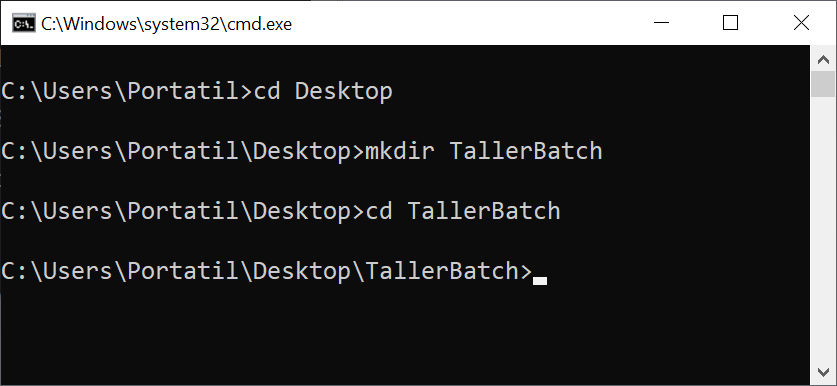
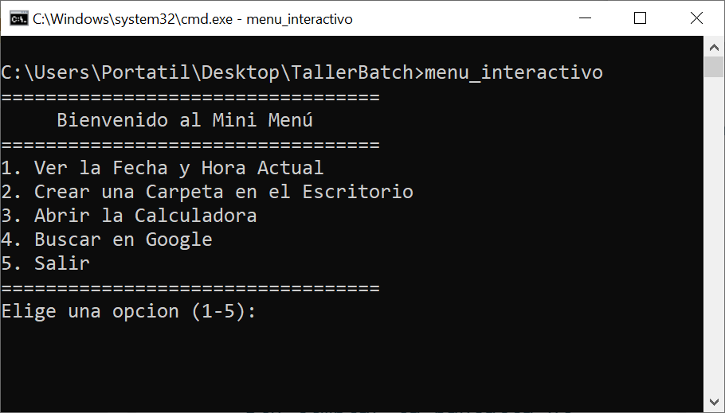

# 💻 Archivos Batch en MS-DOS

## ¿Qué es un Batch File?

Un **batch file** (archivo por lotes) es un archivo de texto simple que contiene una secuencia de comandos específicos del sistema operativo MS-DOS (o Windows). Estos comandos se ejecutan de manera secuencial, uno tras otro, cuando el archivo por lotes es ejecutado. Los batch files suelen tener la extensión `.bat` o `.cmd`.

<details><summary>💡Hint: ¿Por qué se llama "batch file"?</summary>

En MS-DOS, un `batch file` (archivo por lotes) es un archivo de texto que contiene una serie de comandos que el sistema operativo ejecuta de manera secuencial. La palabra "batch" en inglés se traduce como "lote" en español, haciendo referencia a un conjunto de elementos que se manejan juntos. 

El término proviene de "procesamiento por lotes", una técnica donde se ejecutan múltiples tareas de una vez, sin intervención del usuario, como si fueran un solo grupo o "lote" de comandos. 

</details>

### ¿Por qué utilizar Batch Files?

Los batch files se utilizan para automatizar tareas repetitivas, simplificar procesos complejos, y facilitar la administración de sistemas. Son herramientas valiosas para:

- **Automatizar tareas**: Ejecutan múltiples comandos con un solo clic, lo que ahorra tiempo.
- **Administrar archivos**: Realizan tareas de copia, movimiento, eliminación y renombrado de archivos automáticamente.
- **Configurar sistemas**: Ajustan configuraciones del sistema, instalan software o configuran entornos de trabajo.
- **Interacción con el usuario**: Solicitan entradas, muestran mensajes personalizados y manejan flujos de trabajo.

## Ejemplos Interesantes de Batch Files

### Ejemplo 1: Mini Menú Interactivo

### Objetivo:

Crear un batch file llamado `menu_interactivo.bat` que:
1. Salude al usuario y muestre un menú de opciones.
2. Permita al usuario elegir entre ver la fecha y hora, crear una carpeta, abrir la calculadora, o buscar algo en Google.
3. Ejecute la acción seleccionada y vuelva al menú.

### Paso a Paso para Crear el Archivo Batch

#### Paso 1: Crear la Carpeta `TallerBatch` en el Escritorio

1. Abre la terminal de MS-DOS (CMD):
   - Presiona `Windows + R` en tu teclado.
   - Escribe `cmd` y presiona `Enter`.

2. Navega al Escritorio escribiendo el siguiente comando y presiona `Enter`:

    ```cmd
    cd Desktop
    ```

3. Crea la carpeta llamada `TallerBatch` en el Escritorio:

    ```cmd
    mkdir TallerBatch
    ```

4. Ingresa a la carpeta recién creada::

    ```cmd
    cd TallerBatch
    ```
Después de completar los pasos anteriores, tu pantalla en la terminal CMD debería verse similar a la siguiente imagen:


<p align="center">
  
</p>

La imagen muestra los comandos ejecutados correctamente: cambiar al Escritorio, crear la carpeta `TallerBatch` y entrar en ella. Verifica que la ruta de la terminal indique que estás dentro de la carpeta `TallerBatch`. Esto confirma que estás listo para proceder con los siguientes pasos del tutorial.

#### Paso 2: Crear el Archivo Batch `menu_interactivo.bat`

1. Abre el Bloc de Notas escribiendo el siguiente comando en la terminal y presionando `Enter`:

    ```cmd
    notepad menu_interactivo.bat
    ```

2. En el Bloc de Notas, copia y pega el siguiente código:

```batch
@echo off
rem Mini Menú Interactivo
:inicio
echo ==================================
echo      Bienvenido al Mini Menú
echo ==================================
echo 1. Ver la Fecha y Hora Actual
echo 2. Crear una Carpeta en el Escritorio
echo 3. Abrir la Calculadora
echo 4. Buscar en Google
echo 5. Salir
echo ==================================
set /p opcion=Elige una opcion (1-5): 

rem Ejecutar la opción seleccionada
if %opcion%==1 goto fechaHora
if %opcion%==2 goto crearCarpeta
if %opcion%==3 goto abrirCalculadora
if %opcion%==4 goto buscarGoogle
if %opcion%==5 goto salir

rem Manejar opciones inválidas
echo Opción inválida, intenta de nuevo.
goto inicio

:fechaHora
echo Mostrando la fecha y hora actual...
echo Fecha: %date%
echo Hora: %time%
goto inicio

:crearCarpeta
set /p nombreCarpeta=Introduce el nombre de la carpeta: 
mkdir %USERPROFILE%\Desktop\%nombreCarpeta%
echo Carpeta '%nombreCarpeta%' creada en el Escritorio.
goto inicio

:abrirCalculadora
echo Abriendo la Calculadora...
start calc
goto inicio

:buscarGoogle
set /p busqueda=Escribe lo que quieres buscar en Google: 
set busqueda=%busqueda: =+%
start https://www.google.com/search?q="%busqueda%"
goto inicio

:salir
echo Has decidido salir del menú. Gracias por usar el Mini Menú.
goto :eof
```

3. Guarda el archivo en el Bloc de Notas (`Ctrl + G`) y ciérralo.

#### Paso 3: Ejecutar el Archivo Batch

1. Asegúrate de que la ventana CMD esté abierta y que te encuentres dentro de la carpeta `TallerBatch`.

2. Ejecuta el archivo batch escribiendo el siguiente comando y presionando `Enter`:

   ```cmd
   menu_interactivo.bat
   ```

<details><summary>💡Hint: ¿Problemas con las tildes?</summary>

### ¿Por qué no se ven bien las tildes y cómo solucionarlo?

El problema de las tildes y caracteres especiales que no se muestran correctamente en los archivos batch es común debido a la configuración del conjunto de caracteres en CMD. Por defecto, CMD utiliza la página de códigos 437 (US) o 850 (OEM Latin 1), que no soporta adecuadamente los caracteres acentuados en español.

**Solución: Cambiar la página de códigos desde CMD**

Para corregir este problema sin modificar el archivo batch, simplemente cambia la página de códigos a UTF-8 (código 65001) antes de ejecutar el archivo:

1. **Escribe el siguiente comando en CMD antes de ejecutar tu batch file:**

   ```cmd
   chcp 65001
   ```

   Esto cambiará la página de códigos a UTF-8, permitiendo que las tildes y otros caracteres especiales se muestren correctamente.

2. **Ejecuta tu archivo batch normalmente:**

   ```cmd
   menu_interactivo.bat
   ```

Con este sencillo ajuste, las tildes y caracteres especiales deberían verse correctamente al ejecutar tu script.

</details>

4. El menú interactivo aparecerá en la pantalla, mostrando varias opciones:
   - **Opción 1** muestra la fecha y hora actual.
   - **Opción 2** permite crear una carpeta en el escritorio.
   - **Opción 3** abre la calculadora.
   - **Opción 4** abre una búsqueda en Google con la frase completa que el usuario escriba.
   - **Opción 5** finaliza el script y vuelve al CMD sin cerrar la ventana.

5. Prueba cada opción para ver cómo funciona y realiza las acciones correspondientes.

<p align="center">
  
</p>

### Explicación Detallada de `menu_interactivo.bat`

1. **`@echo off`**: Desactiva la visualización de los comandos que se ejecutan en el batch file, dejando solo la salida relevante para el usuario.

2. **`rem Mini Menú Interactivo`**: `rem` es usado para agregar comentarios en el código, que no afectan la ejecución del script pero sirven para documentarlo.

3. **`goto :inicio`** y **`goto :eof`**: Controlan el flujo del programa, moviendo la ejecución a la etiqueta especificada (`:inicio` o `:eof`). `:inicio` lleva al comienzo del menú y `:eof` termina la ejecución sin cerrar CMD.

4. **Menú Principal**:
   - Muestra las opciones disponibles al usuario usando `echo`.
   - Usa `set /p opcion=` para capturar la selección del usuario.
   - Dependiendo de la opción ingresada, se redirige a diferentes secciones usando `goto`.

5. **Gestión de Opciones**:
   - `if %opcion%==1 goto fechaHora`: Verifica si la opción seleccionada es 1 y dirige al bloque de código `:fechaHora`.
   - Repite este patrón para cada opción del menú, dirigiendo al bloque correspondiente.

6. **Opciones del Menú**:
   - **Fecha y Hora (`:fechaHora`)**:
     - Usa `%date%` y `%time%` para mostrar la fecha y la hora actuales.
     - Regresa al inicio del menú con `goto inicio`.

   - **Crear Carpeta (`:crearCarpeta`)**:
     - Usa `set /p` para pedir al usuario el nombre de la carpeta a crear.
     - `mkdir %USERPROFILE%\Desktop\%nombreCarpeta%` crea la carpeta en el escritorio del usuario.
     - Vuelve al menú principal.

   - **Abrir Calculadora (`:abrirCalculadora`)**:
     - Ejecuta la calculadora de Windows con `start calc`.

   - **Buscar en Google (`:buscarGoogle`)**:
     - Permite al usuario escribir una frase de búsqueda.
     - Reemplaza los espacios por `+` para formar una URL válida y abre la búsqueda en el navegador.

7. **Salir del Script (`:salir`)**:
   - Muestra un mensaje de despedida y usa `goto :eof` para finalizar la ejecución del batch file, dejando CMD abierta.

&nbsp;

<p align="center">
  
</p>

# Taller: Personaliza tu Menú Interactivo

**Objetivo del Taller:** Crear un menú interactivo en un archivo batch llamado `mi_bash_menu.bat`, que permita abrir programas favoritos y acceder a sitios web útiles. Además, agregarás opciones personalizadas y creativas para ampliar la funcionalidad del menú.

**Instrucciones del Taller:**

1. **Crea el archivo `mi_bash_menu.bat`:**
   - Abre CMD y asegúrate de estar en la carpeta `TallerBatch` en tu escritorio.
   - Crea un archivo batch nuevo con el nombre `mi_bash_menu.bat` utilizando un editor de texto como Notepad.

2. **Implementa las Siguientes Opciones en el Menú:**

   - **Abrir Microsoft Word:**
     - Añade una opción en el menú que permita abrir Microsoft Word directamente desde el batch file.

     <details><summary>💡Tip</summary>

     - Para abrir Microsoft Word desde el batch file, utiliza el comando `start winword`, ya que `winword` es el nombre del ejecutable de Microsoft Word.

     </details>

   - **Abrir Microsoft Excel:**
     - Añade una opción que abra Microsoft Excel, permitiendo a los usuarios acceder rápidamente a sus hojas de cálculo.

     <details><summary>💡Tip</summary>

     - Para abrir Microsoft Excel desde el batch file, utiliza el comando `start excel`, ya que `excel` es el nombre del ejecutable de Microsoft Excel.

     </details>

   - **Acceder a la página web de la Universidad Javeriana Cali:**
     - Añade una opción que abra la página oficial de la universidad: [www.javerianacali.edu.co](https://www.javerianacali.edu.co).

   - **Acceder a otra página web favorita:**
     - Añade una opción personalizada que permita al usuario abrir directamente otra página web favorita, como su correo electrónico, redes sociales o un sitio de noticias.

   - **Reproducir Video Musical Favorito 1:**
     - Añade una opción que permita reproducir un video musical de YouTube que más te guste. Personaliza esta opción con el enlace a uno de tus videos musicales favoritos.

   - **Reproducir Video Musical Favorito 2:**
     - Añade una opción que permita reproducir otro video musical favorito de YouTube. Puedes elegir cualquier video de música que disfrutes y usarlo como fuente de inspiración.

   - **Opción Creativa: Bloquear la pantalla:**
     - Añade una opción que permita bloquear la pantalla de la computadora con un solo clic para proteger la privacidad cuando se necesita alejarse rápidamente del equipo.

<input type="hidden" value="Para bloquear la pantalla, puedes usar el comando: rundll32.exe user32.dll,LockWorkStation. Este comando bloquea la sesión actual, mostrando la pantalla de inicio de sesión.">

3. **Código de Referencia para el Batch File:**

Aquí tienes un ejemplo de cómo podría estructurarse el archivo `mi_bash_menu.bat` con las opciones solicitadas:

```batch
@echo off
:inicio
echo ==================================
echo      Bienvenido a Mi Bash Menu
echo ==================================
echo 1. Abrir Microsoft Word
echo 2. Abrir Microsoft Excel
echo 3. Abrir Página de la Universidad Javeriana Cali
echo 4. Abrir Página Favorita
echo 5. Reproducir Video Musical Favorito 1
echo 6. Reproducir Video Musical Favorito 2
echo 7. Salir
echo ==================================
set /p opcion=Elige una opcion (1-7): 

if %opcion%==1 goto abrirWord
if %opcion%==2 goto abrirExcel
if %opcion%==3 goto abrirJaveriana
if %opcion%==4 goto abrirFavorito
if %opcion%==5 goto videoFavorito1
if %opcion%==6 goto videoFavorito2
if %opcion%==7 goto salir

echo Opción inválida, intenta de nuevo.
goto inicio
```
